简单总结一下这次作业。基于Lucene的全文搜索功能和WebService的封装。<!-- more -->

1. 在你的项目中增加基于Solr或Lucene的针对书籍简介的全文搜索功能，用户可以在搜索界面输入搜索关键词，你可以通过全文搜索引擎找到书籍简介中包含该关键词的书籍列表。为了实现起来方便，你可以自己设计文本文件格式来存储书籍简介信息。例如，你可以将所有书籍的简介信息存储成为JSON对象，包含书的ID和简介文本，每行存储一本书的JSON对象。

2. 请将上述全文搜索功能开发并部署为Web Service。

 

## 一、**开发基于Lucene的全文搜索功能**

我们实现一个ApplicationRunner接口，这样它会在SpringBoot启动的时候自动执行一次，把数据库中的书籍及其间接建立索引。

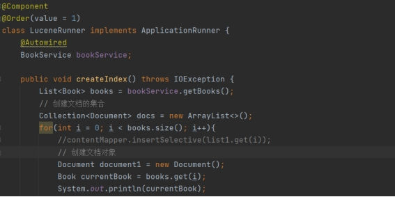 

为了测试这个功能，我们添加了一个用于测试的Controller。

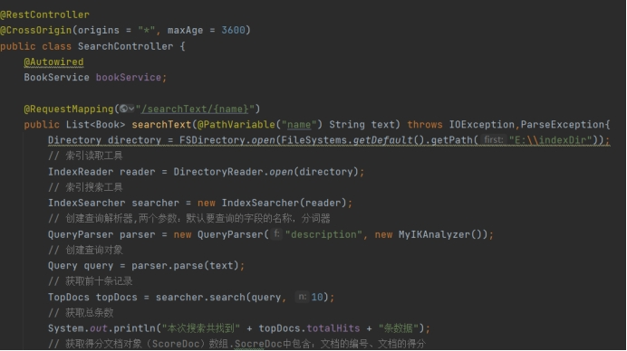 

我们分别输入“你”和“奥秘”作为关键词，我们可以清楚地看见确实返回了所有包含关键词的书籍。

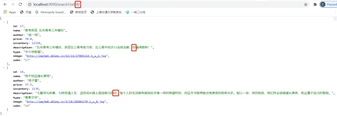 

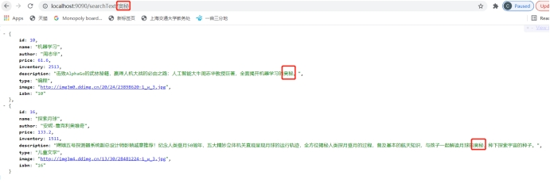 

 

二、把全文搜索功能整合到WebService中

如果说第一部分在十分钟内就可以基本上完成的话，这部分就非常冗长了。首先是WebService的选型，我首先选了Jax-ws作为后端webservice的实现。后面实现起来一切正常，但是当我想整合前端时出现了巨大的问题。简而言之就是，前端因为要组装text/xml作为SOAP协议的body，但是在firefox和Chrome中，这属于“非简单请求”，会自动先发送一个preflight。

非简单请求的CORS请求，会在正式通信之前，增加一次HTTP查询请求，称为"预检"请求（preflight）"预检"请求用的请求方法是OPTIONS，表示这个请求是用来询问的。头信息里面，关键字段是Origin，表示请求来自哪个源。浏览器先询问服务器，当前网页所在的域名是否在服务器的许可名单之中，以及可以使用哪些HTTP动词和头信息字段。只有得到肯定答复，浏览器才会发出正式的XMLHttpRequest请求，否则就报错。

就是因为这个OPTION请求让Jax-ws用不了，发请求的时候SpringBoot会报出：

com.sun.xml.internal.ws.server.http : 无法处理 HTTP 方法: OPTIONS

我们需要定义interceptor去拦截这个OPTIONS请求，并且返回一个200:OK，但是找了半天不知道这个接口在哪里。使用SpringBoot的HandlerInterceptor也拦不到这个OPTIONS请求，陷入僵局。

后来看到了这篇文章[js调用webservice接口时后台无法处理OPTIONS请求的解决方法](https://blog.csdn.net/qq_32539053/article/details/109310670)，只能弃用Jax-ws，启用cxf。

拦截器参考网上的抄了一份过来，简单而言就是如果拦截到的是preflight，那就设置对应的Header后返回200:OK。

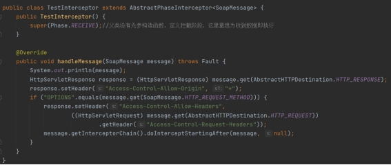 

具体的webservice倒显得很容易了，如下是Service层的代码，还有一个CXFConfig类。

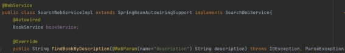 

我们可以在对应暴露出的url后添加?wsdl，来得到这个webservice对应的wsdl文件。

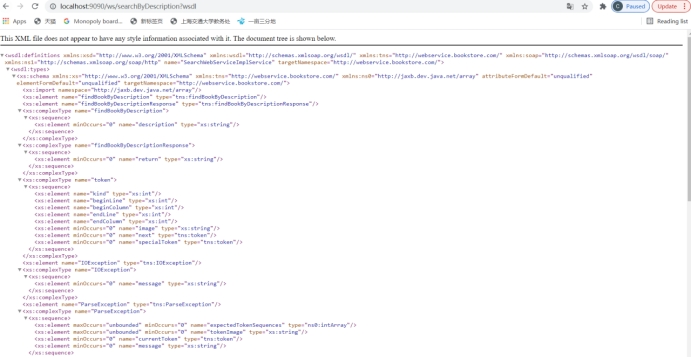 

理论上前端应该是要parse这个wsdl文件然后生成对应的SOAP消息的，不过限于时间，和具体业务其实不需要这么大的灵活度，所以就没做，固定了前端的格式。

值得一提的是，前端的SOAP消息格式是使用了SOAPUI这个软件，传入wsdl文件后自动生成出来的，节省了我很多debug的时间。

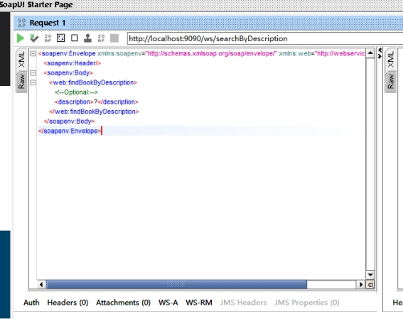 

剩下的无非就是前端的一些工作了，封装出对应的SOAP消息生成和解析器即可。

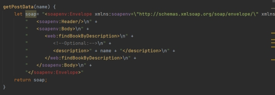 

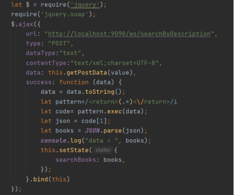 

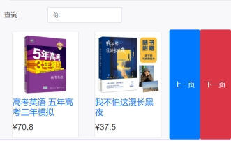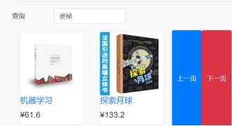 

搜索“你”和“奥秘”，结果与之前我们在controller中测试的结果完全相同。任务结束。