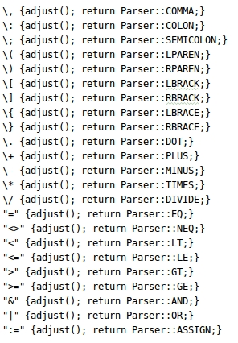
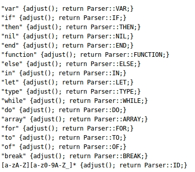
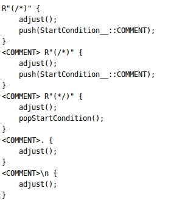
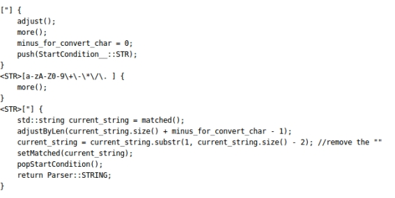
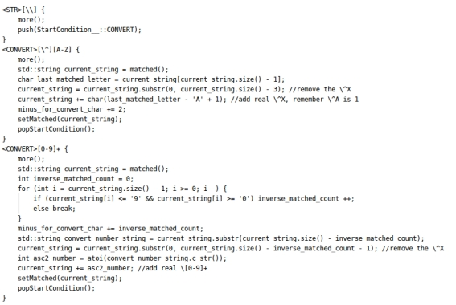
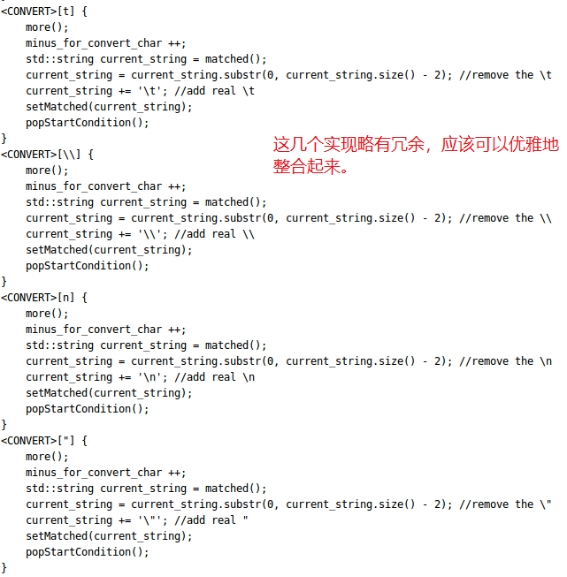
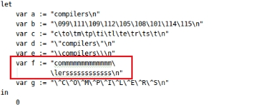
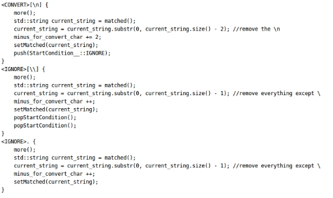

# **编译原理lab2**

总而言之前前后后好几天时间都在搞这个lab，不过主要花的时间可能是大半天时间。为了留下点东西，姑且总结一下这个lab。<!-- more -->

其实这个lab可以说是烦而不难，基本上搞清楚flex c++的执行流，就完全可以干掉这个lab。

 

上面是一些无关痛痒的指令，算是第一步就可以很轻易写出来的东西。

 

## 一、**处理嵌套注解**

 

嵌套注解的处理其实从原理上就和括号匹配一样，至少要维护一个整形作为匹配的进度（/*加一、*/减一，最终为0时匹配完毕）。但是这样实现就要区分出在匹配完毕时（非注解情况下）和匹配进行时（注解情况下）的不同执行流，需要更改全部代码。其实，仔细查看lab2的提示和flex c++的文档就可以发现它提供了start condition来处理不同情况下的处理，这是一个很好用的工具。如上图所示，一旦匹配到了开始符号/*，那么自动push一个COMMENT状态即可；一旦匹配到了结束符号，那么就从栈中pop一个状态。

 

## 二、**字符串的处理**

这部分是我debug了最久的地方，因为经常会出现匹配上了，但是开始的位置和标准答案差一个的情况、或者字符串后的各种符号平移了几位的情况，这是因为多种原因造成的：

\1. 比如A=”5”的情况，在匹配第一个”的时候，如果没有adjust，最终的开始位置就会在等号处。

\2. 匹配转义字符时，不能根据最终转义完成的字符串的长度来计算adjust，这样会导致adjust数量过少。

首先是匹配普通字符串的情况，lex代码如下：

 

由于adjust函数会自动根据matched的字符串的长度来做调整位置，所以我们自己添加了一个adjustByLen，里面添加了对转义字符的offset。接下来是对转义字符的支持，主要可以分为四类：

\1. \^A, \^B, ...., \^Z，具体其含义我们不细究，反正查ASCII表可知其值为1~26。

\2. \xxx，其中x为0~9的数字，也就是直接指定ASCII码。

\3. \n, \t, \”等，直接转义为对应字符即可。

\4. \跟了一个换行符的情况，我们需要支付字符串跨行输入，这个下一节再说。

总体逻辑就是trim我们的matched string，把转义使用的\x都修剪掉，换成真的对应的转义字符。注意，我们需要累积计算我们的offset，这样我们才能知道最终我们需要移动多少位。

 

接下来是例子52中出现的这种情况：

 

我们自然也需要给予支持，也就是\+一个换行符，自动进入ignore状态，等到读到下一个\后，才退出到正常的字符串处理状态。注意ignore了多少个字符也需要添加进offset中。

 

 