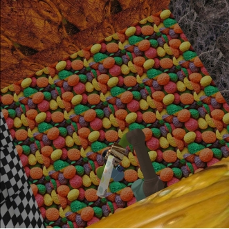
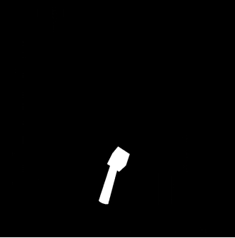
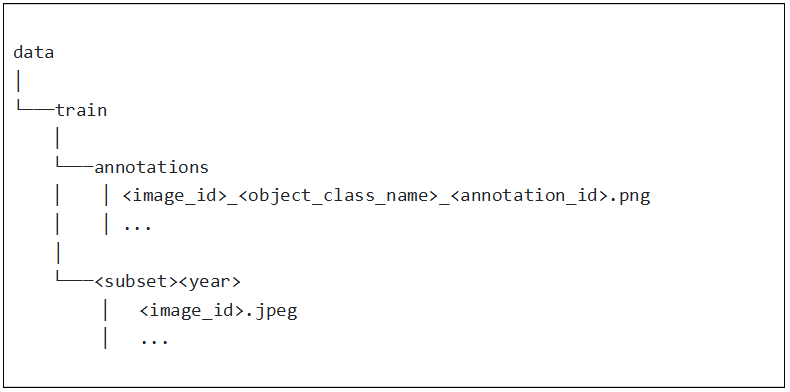
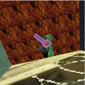
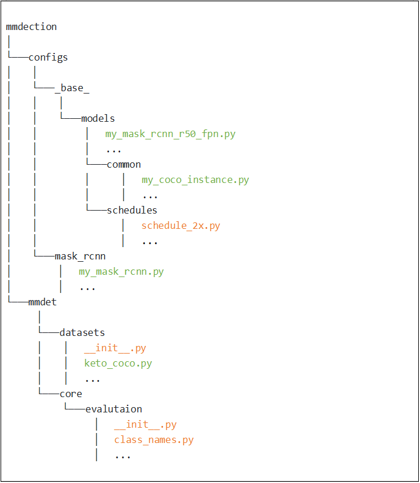
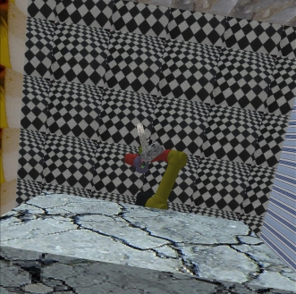
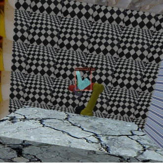
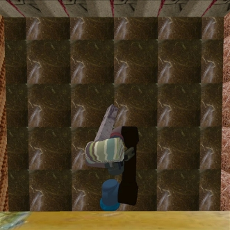
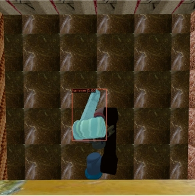

The first time for me to construct a custom dataset and apply it in the mmdection.

The whole pipeline is as follows:

**I. Collect and prepare the raw dataset.**

**II. Convert the raw dataset into COCO style.**

**III. Add and movify the mask-rcnn configuration in mmdection API to fit our requirement.**

**IV. Train the model by mmdection.**

**V. Evaluate and visualize the test dataset.**

**VI. Modify the result into mask image so that we can insert it smoothly in our pipeline.**

 <!-- more -->

Because of the fact that the project is still undergoing, the part I and part VI will NOT be described detailedly.

## **1.The dataset**

 

As shown above, it’s a sample from my created dataset which contains a rgb image and corresponding mask. The foreground is a tool(the hammer), and the background contains other unrelated things. At the very beginning when there was no relationship to how to training, it is of top priority to create enough data and split them into train, validate and test dataset. We collected 4535 imgs, 464 imgs and 454 imgs for training, validating and evaluating.

 

## 2. **The format of COCO**

As said by a famous blog, we use COCO to reconstruct our data is not because it is the best format, but it is the most widely used and accepted format. So we need to arrange our dataset in that format. To our relief, there are a lot of tools to help us automatically conduct such procedure, for example, [pycococreator](https://github.com/waspinator/pycococreator).

What we need to do is only to set the related INFO, LICENSES, CATEGORIES and corresponding directory.

```python
INFO = {
    "description": "Hammer Segmentation Dataset",
    "url": "https://github.com/Kami-code",
    "version": "0.1.0",
    "year": 2022,
    "contributor": "Kami-code",
    "date_created": datetime.datetime.utcnow().isoformat(' ')
}

LICENSES = [
    {
        "id": 1,
        "name": "Attribution-NonCommercial-ShareAlike License",
        "url": "http://creativecommons.org/licenses/by-nc-sa/2.0/"
    }
]

CATEGORIES = [
    {
        'id': 1,
        'name': 'hammer',
        'supercategory': 'none',
    },
]

...
def main():
    ROOT_DIR = 'hammer_' + MODE
    IMAGE_DIR = os.path.join(ROOT_DIR, "rgb")
    ANNOTATION_DIR = os.path.join(ROOT_DIR, "mask")
    coco_output = {
        "info": INFO,
        "licenses": LICENSES,
        "categories": CATEGORIES,
        "images": [],
        "annotations": []
    }
...
```



The structure is from the [blog](https://patrickwasp.com/create-your-own-coco-style-dataset/). You can refer to it to create your custom dataset. What I want to mention is if we have a lot of mask of different objects on a single image(though not in our current settings), the annotation_id should start from 0 and increase for each mask, while the meaning of image_id is easily understood. By the way, it seems no need to make annotation_id the same as “id” in CATEGORIES, so making it start from zero is necessary.

After running the script of [pycococreator](https://github.com/waspinator/pycococreator/blob/master/examples/shapes/shapes_to_coco.py), we get a single json file named “instance_train2022.json”. We can use the visualizer script provided in that repo to visualize to check whether we successfully get a COCO json file. COCO will contain the information which provided in the mask.png file using contour algorithm.(Finally, they will be stored in polygons format.) 

 

Since now, we have successfully got our first COCO dataset!

 

## 3. **MMDection**

[MMDetection](https://github.com/open-mmlab/mmdetection) is an open source object detection toolbox based on PyTorch. It is a part of the OpenMMLab project. It provides a abstraction on the PyTorch which enables me train my network without writing any code. Frankly speaking, I will not use it if I have enough time to dig deep in mask-rcnn, cause it makes me tightly rely on the API, which do no good for my career. For now, given limited time, I have to use it. 

To use it, I mainly refer to the proceduce in [this zhihu blog](https://zhuanlan.zhihu.com/p/344841580). But it also contains some frustrating bug, which I will explain below.



This is the files need to add and modify if we want to add a new dataset to train by mask_rcnn. (marked in green means the newly-added file and marked in brown means the file needed to be modified)

Let’s find how exactly these files works.


mmdection/configs/mask_rcnn/my_mask_rcnn.py

```python
_base_ = [
    '../_base_/models/my_mask_rcnn_r50_fpn.py',
    '../common/my_coco_instance.py',
'../_base_/schedules/schedule_2x.py' ,
'../_base_/default_runtime.py',
]
```

The file just links all the files we added.

Next, we should define our own dataset structure, since we’ve got the dataset in COCO format. We can replicate the coco.py and change a little to get our “keto_coco.py”.


 mmdection/mmdet/datasets/coco.py

```python
@DATASETS.register_module()
class CocoDataset(CustomDataset):

    CLASSES = ('person', 'bicycle', 'car', 'motorcycle', 'airplane', 'bus',
               'train', 'truck', 'boat', 'traffic light', 'fire hydrant',
               'stop sign', 'parking meter', 'bench', 'bird', 'cat', 'dog',
               'horse', 'sheep', 'cow', 'elephant', 'bear', 'zebra', 'giraffe',
               'backpack', 'umbrella', 'handbag', 'tie', 'suitcase', 'frisbee',
               'skis', 'snowboard', 'sports ball', 'kite', 'baseball bat',
               'baseball glove', 'skateboard', 'surfboard', 'tennis racket',
               'bottle', 'wine glass', 'cup', 'fork', 'knife', 'spoon', 'bowl',
               'banana', 'apple', 'sandwich', 'orange', 'broccoli', 'carrot',
               'hot dog', 'pizza', 'donut', 'cake', 'chair', 'couch',
               'potted plant', 'bed', 'dining table', 'toilet', 'tv', 'laptop',
               'mouse', 'remote', 'keyboard', 'cell phone', 'microwave',
               'oven', 'toaster', 'sink', 'refrigerator', 'book', 'clock',
               'vase', 'scissors', 'teddy bear', 'hair drier', 'toothbrush')
    ...
```

mmdection/mmdet/datasets/keto_coco.py

```python
@DATASETS.register_module()
class KpCocoDataset(CustomDataset):

    CLASSES = ['hammer',]
    ...
```

As we can see, what we do is just set the CLASSES variable into a list only containing one class hammer. The reason that we change the tuple to list seems to be a version-related problem that the low-level function will misleadingly parse the wrong type.

 

mmdection/mmdet/datasets/__init__.py

```python
__all__ = [
    'CustomDataset', 'XMLDataset', 'CocoDataset', 'DeepFashionDataset',
    'VOCDataset', 'CityscapesDataset', 'LVISDataset', 'LVISV05Dataset',
    'LVISV1Dataset', 'GroupSampler', 'DistributedGroupSampler',
    'DistributedSampler', 'build_dataloader', 'ConcatDataset', 'RepeatDataset',
    'ClassBalancedDataset', 'WIDERFaceDataset', 'DATASETS', 'PIPELINES',
    'build_dataset', 'replace_ImageToTensor', 'get_loading_pipeline',
    'NumClassCheckHook', 'CocoPanopticDataset', 'MultiImageMixDataset',
    'KpCocoDataset'
]
```

Since we defined our KpCocoDataset, to make it register into the dataset collection, we need to add the structure name into its __init__.py and recomplie the module.

In class_names.py, we should also add a simple function to get the classes of our defined dataset.


mmdection/mmdet/core/evaluation/class_name.py

```python
...
def kp_coco_classes():
    return ['hammer']
...
```


Also, a change in __init__.py is necessary. But there is no explicit call of this function, I GUESS the function may not be called or is called by its name in some format.

The my_mask_rcnn_r50_fpn.py is replicated from the mask_rcnn_r50_fpn.py. We just change the class_num parameter 80 to 1.

In my_coco_instance.py, we defined the path of the three COCO json files, and train and test pipeline.


mmdection/configs/common/my_coco_instance.py

```python
...
data = dict(
    samples_per_gpu=2,
    workers_per_gpu=2,
    train=dict(
        type='RepeatDataset',
        times=4,
        dataset=dict(
            type=dataset_type,
            ann_file=data_root + 'annotations/instances_train2022.json',
            img_prefix=data_root + 'train2022/',
            pipeline=train_pipeline)),
    val=dict(
        type=dataset_type,
        ann_file=data_root + 'annotations/instances_validate2022.json',
        img_prefix=data_root + 'validate2022/',
        pipeline=test_pipeline),
    test=dict(
        type=dataset_type,
        ann_file=data_root + 'annotations/instances_test2022.json',
        img_prefix=data_root + 'test2022/',
        pipeline=test_pipeline),
)
...
```

And we will train the data on a single GPU with 2 samples_per_gpu, so we should downsize the learning rate defined in schedule_2x.py 8 times, because it’s default value is assuming the training is on 8 GPUs with 2 samples_per_gpu.

## 4. **Train our model**

We can use the following command line to start training process. Though I have spent much time in debugging in the process. If we correctly config the mentioned files, it will finally works.

```
python tools/train.py configs/mask_rcnn/my_mask_rcnn.py
```

When training, we can read the logs to make sure we are on the right track.

```
2021-10-27 15:16:22,077 - mmdet - INFO - Epoch [1][2400/9070]  lr: 2.500e-03, eta: 17:30:32, time: 0.288, data_time: 0.010, memory: 7875, loss_rpn_cls: 0.0216, loss_rpn_bbox: 0.0081, loss_cls: 0.0925, acc: 97.2070, loss_bbox: 0.1120, loss_mask: 0.1732, loss: 0.4074
```

How are the batches each epoch 9070 calculated? Recall that we set the training set to be repeat dataset 4, which means the total training dataset is 4535 * 4 = 18140. And we configure the training process on a single with samples_per_gpu = 2. So we get batch_size = 18140 / 2 = 9070. 

```
2021-10-27 22:03:28,363 - mmdet - INFO - Evaluating segm...
Loading and preparing results...
DONE (t=0.04s)
creating index...
index created!
Running per image evaluation...
Evaluate annotation type *segm*
DONE (t=0.46s).
Accumulating evaluation results...
DONE (t=0.05s).
 Average Precision  (AP) @[ IoU=0.50:0.95 | area=   all | maxDets=100 ] = 0.367
 Average Precision  (AP) @[ IoU=0.50      | area=   all | maxDets=1000 ] = 0.416
 Average Precision  (AP) @[ IoU=0.75      | area=   all | maxDets=1000 ] = 0.415
 Average Precision  (AP) @[ IoU=0.50:0.95 | area= small | maxDets=1000 ] = -1.000
 Average Precision  (AP) @[ IoU=0.50:0.95 | area=medium | maxDets=1000 ] = 0.365
 Average Precision  (AP) @[ IoU=0.50:0.95 | area= large | maxDets=1000 ] = 0.369
 Average Recall     (AR) @[ IoU=0.50:0.95 | area=   all | maxDets=100 ] = 0.373
 Average Recall     (AR) @[ IoU=0.50:0.95 | area=   all | maxDets=300 ] = 0.373
 Average Recall     (AR) @[ IoU=0.50:0.95 | area=   all | maxDets=1000 ] = 0.373
 Average Recall     (AR) @[ IoU=0.50:0.95 | area= small | maxDets=1000 ] = -1.000
 Average Recall     (AR) @[ IoU=0.50:0.95 | area=medium | maxDets=1000 ] = 0.369
 Average Recall     (AR) @[ IoU=0.50:0.95 | area= large | maxDets=1000 ] = 0.375
2021-10-27 22:03:28,939 - mmdet - INFO - Exp name: my_mask_rcnn.py
2021-10-27 22:03:28,939 - mmdet - INFO - Epoch(val) [9][464]    bbox_mAP: 0.3800, bbox_mAP_50: 0.4210, bbox_mAP_75: 0.4090, bbox_mAP_s: -1.0000, bbox_mAP_m: 0.3880, bbox_mAP_l: 0.3760, bbox_mAP_copypaste: 0.380 0.421 0.409 -1.000 0.388 0.376, segm_mAP: 0.3670, segm_mAP_50: 0.4160, segm_mAP_75: 0.4150, segm_mAP_s: -1.0000, segm_mAP_m: 0.3650, segm_mAP_l: 0.3690, segm_mAP_copypaste: 0.367 0.416 0.415 -1.000 0.365 0.369
```


Some results are as shown in the sheet. In this article, we don’t detailedly find out each number means.

 

## 5. **Eval and visualize our model**

We can run the following script to visualize our model.

```python
from mmdet.apis import init_detector, inference_detector, show_result_pyplot

if __name__ == '__main__':
    config_file = 'mmdetection/configs/mask_rcnn/my_mask_rcnn.py'
    # url: https://download.openmmlab.com/mmdetection/v2.0/faster_rcnn/faster_rcnn_r50_fpn_1x_coco/faster_rcnn_r50_fpn_1x_coco_20200130-047c8118.pth
    checkpoint_file = 'mmdetection/work_dirs/my_mask_rcnn/latest.pth'
    device = 'cpu'
    # init a detector
    model = init_detector(config_file, checkpoint_file, device=device)
    # inference the demo image
    img = '../tool_seg_data/neee/rgb/1906.jpeg'
    result = inference_detector(model, img)
    show_result_pyplot(model, img, result, score_thr=0.3)
```

 

 

Thank God we finally successfully train the segmentation network.