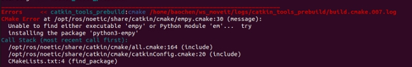
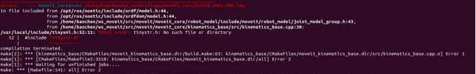
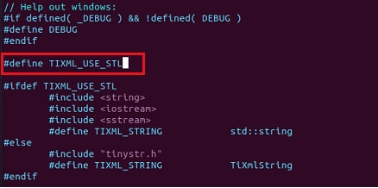
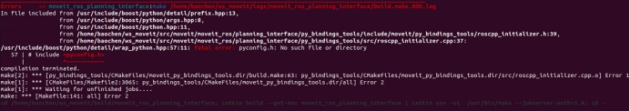
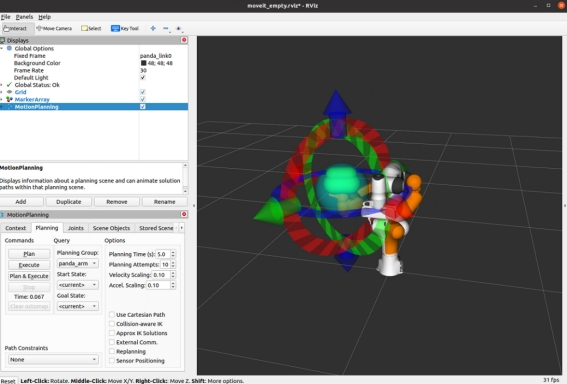
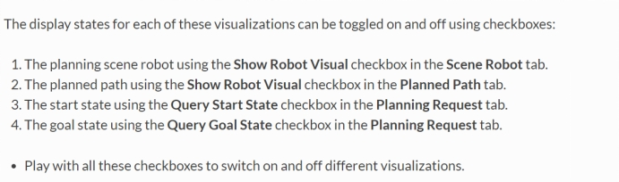
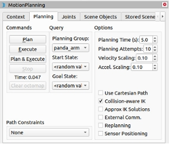
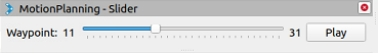

在配置moveit_noetic的时候，不可避免地遇到了一些问题。在此记录一下。 <!-- more -->

官网配置教程地址：

https://ros-planning.github.io/moveit_tutorials/doc/getting_started/getting_started.html 

 

Catkin是ROS官方的构建编译系统，是原先的ROS编译构建系统rosbuild的继承者，它组合了cmake宏和python脚本来在基本的cmake工作流之上提供一些额外的功能。Catkin设计得比rosbuild更加便捷，允许更好地分配package，支持更好的交叉编译以及更好的便捷性。Catkin的工作流和cmake的工作流很像，但是还添加了自动find package的基础结构，并且在同时构建多个相互依赖的项目。

 

catkin编译的工作流程如下：

首先在工作空间catkin_ws/src/下递归的查找其中每一个ROS的package。package中会有package.xml和CMakeLists.txt文件，Catkin(CMake)编译系统依据CMakeLists.txt文件,从而生成makefiles(放在catkin_ws/build/)。

然后make刚刚生成的makefiles等文件，编译链接生成可执行文件(放在catkin_ws/devel)也就是说，Catkin就是将cmake与make指令做了一个封装从而完成整个编译过程的工具。catkin有比较突出的优点，主要是：

1.操作更加简单

2.一次配置，多次使用

3.跨依赖项目编译

使用catkin_make进行编译

$ cd ~/catkin_ws #回到工作空间,catkin_make必须在工作空间下执行

$ catkin_make #开始编译

$ source ~/catkin_ws/devel/setup.bash #刷新坏境

编译完成后，如果有新的目标文件产生（原来没有），那么一般紧跟着要source刷新环境，使得系统能够找到刚才编译生成的ROS可执行文件。这个细节比较容易遗漏，致使后面出现可执行文件无法打开等错误。

 

第一次catkin build的时候，我们遇到如下错误：

 

根据https://github.com/ysl208/iRoPro/issues/59，我们修改原先的catkin_build指令，修改为catkin build -DPYTHON_EXECUTABLE=/usr/bin/python3 -DPYTHON_INCLUDE_DIR=/usr/include/python3.7m。换句话说，ROS的catkin默认的是用python2.7去编译的，哪怕我们安装了python3-empy它依然报错。告诉它使用python3后这个报错就解决了。

 

第二个问题是tinyxml.h找不到tinystr.h文件。我们找到对应位置后在源码中添加TIXML_USE_STL即可解决这个问题，使用标准的STL库来代替tinystr.h。

 

第三处build的问题是

 

它提示我们找不到pyconfig.h，根据这篇博客(https://blog.csdn.net/arcers/article/details/91547138)的提示，我先使用sudo find / -name pyconfig.h，发现在路径/usr/include/python3.8下存在pyconfig.h，原来是解决问题1的时候复制的路径/usr/include/python3.7m根本不存在，把命令改为

`catkin build -DPYTHON_EXECUTABLE=/usr/bin/python3 -DPYTHON_INCLUDE_DIR=/usr/include/python3.8`

即可正常编译成功。

 

接下来我们使用命令roslaunch panda_moveit_config demo.launch rviz_tutorial:=true，这里会再次遇到一个问题https://answers.ros.org/question/384900/failed-to-lunch-this-command/即可解决。

 

自此我们可以正常运行并且看到Rviz界面，添加MotionPlanning后就可以在RViz界面中见到我们的panda机器人。

 

我们首先需要知道4种重叠的可视化：

\1. robot在planning environment中的configuration（各个关节的当前角度）。

\2. robot的plan出来的路径

\3. 绿色：robot motion planning的开始状态

\4. 橙色：robot motion planning的结束状态

 

这些展示的状态可以在上面的motionplanning的下拉框中勾选。Planning scene在show robot visual->Scene Robot中；planning path在show robot visual->Planned Path中；开始状态在Query Start State->Planning Request中；结束状态的设置在Query Start State->Planning Request。

我们可以拖动各个关节的orientation来设置开始状态和结束状态。然后点击plan可以查看整个的运动轨迹。我们勾选use collision-aware IK就可以使得求解器尝试找到一个collision-free的轨迹；如果没有勾选的话，求解器会允许在过程中碰到collision。不过在可视化的时候，存在碰撞的link无论我们有没有勾选use collision-aware IK，都会被标识成红色。

在MotionPlanning的joint窗口下，我们可以拖动nullspace exploration，可以看到在末端执行器的位姿不变的情况下，其他机械臂的configuration是可以变化的（满足连续关系）。

 

现在我们可以开始使用panda机器人在moveit rviz插件中进行运动规划。步骤如下：

\1. 把start state设置到期望的位置

\2. 把goal state设置到期望的位置

\3. 确保这两个state都没有自己和自己碰撞

\4. 确保planned path是可见的

\5. 按下plan键。

 

 

我们在Planning窗口中可以选择不同的start和goal states，eg：当前的状态，之前的状态（之前的planning attempt的start state），一个随机采样的configuration，一个有名字的在srdf中定义的state。

 

我们也可以查看轨迹路径点，只需要在导航栏中打开panels->motionplanning-slider，即可看到对应的路径点并拖动。

 

如果我们勾选use cartesian path的话，robot会尝试直线地移动end effector。

 

[1]Catkin工作原理 https://blog.csdn.net/qq_33876441/article/details/102958248

[2]Catkin conceptual http://wiki.ros.org/catkin/conceptual_overview

[3]https://blog.csdn.net/num8owl/article/details/108689843