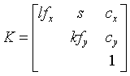

本文章的主题为研究openGL和openCV中的摄像机参数的转化。<!-- more -->

首先要搞清楚，坐标旋转和坐标系旋转的概念。

## **坐标旋转（点的运动）**

 

 

如上图，二维坐标系中的绕原点逆时针旋转度，则得到的B点满足：

把上式写成矩阵乘法的形式：

这是点的运动，坐标系（参照系）并没有发生变化

## **坐标系旋转（基变换）**

 

如上图，把原先的xy基逆时针旋转度到st基，p在xy基下的坐标为，p在st基下的坐标为，求变换关系。

我们有

即

2是坐标系的旋转，点是不动的，得到的是不动的点在变化了的坐标系下的表示

点旋转β相当于坐标系旋转了-β。所以可以直接在1的基础上，把角度反转，就成了坐标系的旋转。

 

## **基变换和坐标变换**

平面解析几何中的直角坐标系有时候需要坐旋转，这实际上是坐标向量绕原点坐旋转，设坐标轴逆时针旋转的角度为，那么不难有，新坐标向量和原坐标向量之间的关系为：

 

OpenCV中的内参矩阵K（计算机视觉——算法和应用P41）

有几种方式来描述上三角矩阵K，一种是

上式使用相互独立的参数来描述x和y维度的焦距和，s项刻画任何可能的传感器轴间的倾斜，这由传感器的安装没有与光轴垂直所引起，而是以像素坐标表达的光心。

在实践中，通过设置和s=0，在很多应用中会使用如下更简单的形式：

通常情况下，通过将原点大致设置在图像的中心，即，其中W和H是图像的高和宽（用像素表示，如600*480），就可以得到仅含一个未知量焦距f的完全可用的摄像机模型。注意上式中的焦距都是以像素为单位表示的，要与现实相机中的毫米焦距等区分开来。

 

要转化到现实中的距离，我们首先需要知道图像的现实宽度，如，然后我们可以通过公式：，这里的就是视场角，也就是FOV，下图就展示了一个的情况。

 

 

 

为了更好地理解OpenGL中的透视投影，我们先来讨论函数glFrustum。根据OpenGL的官方文档，“glFrustum描述了一个透视矩阵，提供了一个透视投影。”这句话没错，但是只说出了一半实情。事实上，glFrustum做了两件事情，首先它进行透视投影，然后它把结果转换到归一化设备坐标系(NDC)上。前者是投影几何中的常规操作，但是后者是OpenGL中特有的实现细节。

为了讲明白这件事情，我们需要把投影矩阵（Projection Matrix）分成两部分，也就是透视矩阵(Prespective Matrix)和NDC矩阵。

	我们的相机内参矩阵可以描述透视投影，所以它是求解出Perspective Matrix的关键。而对于NDC矩阵，我们会使用OpenGL的glOrtho。

 

第一步：投影变换

我们的3x3内参矩阵K为了能在OpenGL中使用需要两个小的变更，一个是为了正确的裁剪，位置3,3的元素必须为-1，因为OpenGL的摄像机是从原点向z的负半轴看的，所以如果位置3,3的元素为正，摄像机前方的顶点在投影后将具有负的w坐标。原则上，这是可以的，但是由于 OpenGL 执行裁剪的方式，所有这些点都会被裁剪。

所以我们现在有了

对于第二个更改，我们需要保护失去的Z轴的深度信息，所以我们会在内参矩阵的基础上添加一行和一列，即：

，其中

新的第三行保持了Z值的顺序的同时，把-near和-far映射到它们自己（在归一化了w后）。这个结果就是在裁剪平面之间的点依旧在乘上了Perspective Matrix后依旧保持在裁剪平面之间。

 

第二步：变换到NDC

NDC矩阵可以通过glOrtho函数提供。Perspective Matrix把一个视锥空间转化为了一个长方体空间，而glOrtho把长方体空间转化为归一化设备空间。

调用glOrtho需要六个参数left,right,bottom,top,near,far

，其中

调用它的时候，far和near就和前述的一样。而top,bottom,left,right的裁剪平面的选取对应原图像的维度和标定时的坐标规范。

举个例子，如果你的摄像机用WxH的左上角为零点的图像标定了，那么就该使用left = 0, right = W, bottom = H, top = 0，注意到H作为了bottom参数而0作为了top参数，这意味着y轴正半轴是向下的规范。

如果标定时使用的是y轴向上的坐标系，并且原点在图像中心的话，那么就是left = -W/2, right = W/2, bottom = -H/2, top = H/2.

注意到其实glOrtho的参数和透视矩阵有很大的关系，比如说把视景体(viewing volume)向左平移X等价于把主轴向右平移X。而让翻倍就等于让left和right参数减半。很明显，用这两个矩阵来描述这个投影是冗余的，但是分别去考察这两个矩阵允许我们分离相机几何学和图像几何学。

 

 

根据文献

https://stackoverflow.com/questions/60430958/understanding-the-view-and-projection-matrix-from-pybullet

在pybullet中，

内参矩阵K为：

和是光心，通常是图像中心。不过有以下不同，

\1. 维度，pybullet保持了第三行和第四列来保持深度信息，这和之前提到的OpenGL相机相同。

\2. 第四行第三列的元素不是1而是-1

\3. Pybullet中s=0

\4. Pybullet中

首先，pybullet使用OpenGL，所以它使用的是列优先的顺序，所以从pybullet中读到的真正的projection matrix应当转置，或者使用numpyarray的order=’F’。

其次，把FOV转化为f的方程如下：

和

因此，pybullet把焦距乘以了2/h，这是因为Pybullet使用归一化设备坐标系（也就是对x除以图像宽度，来归一化到0~1，再乘以2到0~2，所以如果我们的光心在图像中间x=1的位置时，那么裁剪平面就归一化到了-1~1）。因此，pybullet的焦距是使用NDC下的正确的焦距长度。

在内参矩阵K中，k和l是mm/px的比例，在使用pybullet时，我们可以认为k=l=1 mm/px，换句话说，在pybullet形式的内参矩阵中，和是以像素为单位的，而整个矩阵的每个元素都是以mm为单位的。

考虑到以上的所有条件，在pybullet中，内参矩阵为：

，其中

把h=1000和FOV=90代入，

def computeProjectionMatrixFOV(*args, **kwargs): # real signature unknown
  """ Compute a camera projection matrix from fov, aspect ratio, near, far values """
  pass

def computeViewMatrix(*args, **kwargs): # real signature unknown
  """ Compute a camera viewmatrix from camera eye,  target position and up vector """
  pass

 

 

 

http://ksimek.github.io/2013/06/03/calibrated_cameras_in_opengl/

https://amytabb.com/ts/2019_06_28/#conversion-corner-1

http://www.info.hiroshima-cu.ac.jp/~miyazaki/knowledge/teche0092.html

https://zhuanlan.zhihu.com/p/339199471

 