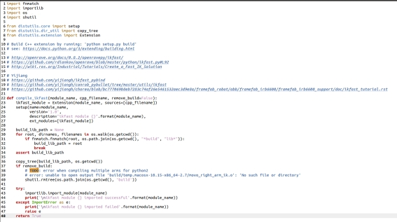

  

 

最近项目过程中经常遇到底层为C++代码的情况，作为一个契机，详尽地研究一下pybind11。<!-- more -->

虽然无关紧要，但是很在意的问题是11这个数字是哪来的，因为pybind11的介绍是 Seamless operability between C++11 and Python，据称其主要内核代码使用了C++11的语言特性，如匿名函数、元组等。

 

如上图所示，这是符合pybind11编程要求的c++代码。

 

图 1 https://zhuanlan.zhihu.com/p/92120645

根据pybind11官网教程，可以使用如下代码进行编译：

c++ -O3 -Wall -shared -std=c++11 -fPIC $(python3 -m pybind11 --includes) example.cpp -o example$(python3-config --extension-suffix)

-Wall 这个编译选项会强制输出所有警告，用于调试。

-o output_filename 确定输出文件的名称为output_filename。同时这个名称不能和源文件同名。如果不给出这个选项，gcc就给出默认的可执行文件a.out。

-fPIC 生成位置无关代码。

-I/home/baochen/anaconda3/include/python3.8 	-I/home/baochen/anaconda3/lib/python3.8/site-packages/pybind11/include

.cpython-38-x86_64-linux-gnu.so

 

 

案例分析：pybullet-planning中的ikfast编译件

 

我们考察如何将一个新的机械臂添加到pybullet-planning中。

首先考察已有的franka_panda机械臂，文件夹内容如下：

 

setup.py内容如下：

 

调用的compile文件如下：

 

基本上就是传入模块名称和cpp文件的路径，然后构建出一个python可以调用的模块。

同目录的ik.py提供了一个向python暴露的接口，其中的IKFastInfo是一个namedtuple，其实就是指定了我们编译出来的模块名字(setup.py中的robot_name和compile_ikfast中的module_name)

 

 