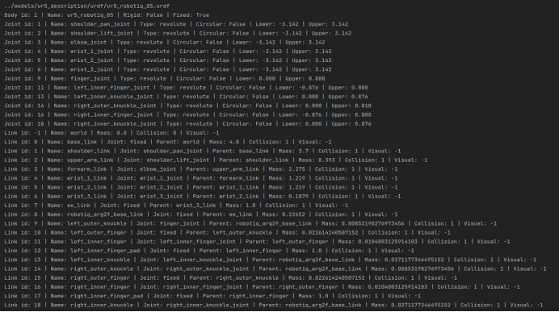

我们尝试来阅读一下pybullet-planning中和ik、planning相关的源码。

<!-- more -->

 

我们尝试从test_franka.py入手

首先是start_pose是起始的关于tool_link的6D位姿，也就是得到pos, orn

同理，end_pose是对于start_pose施加了一个相对位移z=-distance(1m)以后的位置

 

我们可以发现，每一次移动的位置确实是沿着z轴相对位置后退0.1m(因为我们分了十步去处理后退1m的最终目标)

 

分析multiply的源码，有比较陌生的*poses参数，单个*的意思其实就是按照数组形式处理传入的不定长个参数

 

 

术语表：

solve joints: 需要用来求解ik的关节。

free joints: 需要在ik计算前指定的关节，这些值在运行时是已知的，但是在ik创建的时候是未知。(not known at IK generation time)

 

以panda_franka为例，传入的ikfast_info为IKFastInfo(module_name=’franla_panda.ikfast_panda_arm’, base_link=’panda_link0’, ee_link=’panda_link8’, free_joints=[‘panda_joint7’])。因为panda是7个自由度的机器人，所以需要指定一个joint为free joint。

 

以UR5为例，传入的infast_info为IKFastInfo(module_name=’ur5.ikfast_ur5_arm’, base_link=’base_link’, ee_link=’ee_link’, free_joints=[])。因为UR5是6个自由度的机器人，所以不需要指定free joint。

 

link_from_name：根据name得到link id

换句话说，对于一个link，施加get_ordered_ancesters以后可以得到包括这个link在内的其祖先link

 

 

 

以panda为例：

get_ordered_ancestors(panda, ee_link)：[0, 1, 2, 3, 4, 5, 6, 7]

get_ordered_ancesters(panda, tool_link)：[0, 1, 2, 3, 4, 5, 6, 7, 8]

first_joint：连接了base_link的joint

prune_fixed_joints：去除掉固定的joint以后，需要纳入计算的joint。

ik_joints：[0, 1, 2, 3, 4, 5, 6]

free_joints：[6]

assert set(free_joints) <= set(ik_joints)：保证需要设置的free_joint包含在ik_joints内。

assert len(ik_joints) == 6 + len(free_joints)：保证剔除掉free_joints后为6个自由度，比如7自由度关节的机械臂需要1个free_joint，6自由度关节的机械臂需要0个free_joint。

 

difference_fn是一个求差值的函数，对于普通的joint来说，是直接两个参数相减，对于circular joint会有一些特殊的计算方式，但是circular joint在代码中的定义是upper limit < lower limit的情况，并且google也并没有找到什么有用的信息，考虑到我们目前使用的机器人都没有circular joint，就直接当做两个值相减就可以了。

get_length函数就是单纯的求n-范数，范数通过norm参数传进去。

其实closet_inverse_kinematics的后半部分只是在对求出来的解进行排序，找到一个各关节位姿变化的距离最小的解输出。而前半部分是通过generator = ikfast_inverse_kinematics(.....)求解得到了所有的可行解。

在研究ikfast_inverse_kinematics之前，我们先来搞懂interval_generator

 

Np.random.uniform从一个均匀分布[0,1)中随机采样，获得d个数据

Halton sequence:Halton序列是一种为数值方法（如蒙特卡洛模拟算法）产生顶点的系列生成算法。虽然这些序列是以确定的方法算出来的，但它们的偏差很小。也就是说，在大多数情况下这些序列可以看成是随机的。Halton系列于1960年提出，当时是作为quasi-random 数字序列的一个例子。

所以unit_generator是从均匀分布[0,1)中采样d个数据。而在interval_generator这个函数中，也就是随机采样d个0~1之间的权重，传入convex_conbination中。

 

所以其实就是在lower和upper之间随机取d组点，如果joint lower limit = joint upper limit，那么自然就直接取相等。

所以，调用interval_generator会返回一个满足条件的joints的各个角度。

接下来，我们再来尝试搞懂ikfast_inverse_kinematics

 

\1. 首先import_ikfast函数会根据我们传入的ikfast_info去import对应机器人的cpp编译出来的模组，每次需要使用新的机器人时，都要准备好这件事情。

\2. ik_joints和free_joints相对比较容易理解，上文中有提到过这件事情。

\3. lower_limits和upper_limits就是joint的上下界，free_deltas不详。

\4. Islice(generator, max_attempts)，迭代器generator生成max_attempt个proposal后结束

 

所以generator迭代器将原先的joint pose和随机数采样得到的joint pose可行解传入compute_inverse_kinematics中，会继续被传入到每个机械臂特有的ikfast cpp中，具体作用不详，在ur5的ikfast代码中，似乎是在某些条件下会使用采样数据作为某个joint的值。

在ikfast cpp的源码中，我们可以看到这样的表述Computes all IK solutions given a end effector coordinates and the free joints. pfree is an array specifying the free joints of the chain. 换句话说，我们传入的采样得到的sampled参数实际上是指定了对应free joint的本次求解中的值，因为free joint是需要我们指定的，这无可厚非。

\5. 在传入对应参数以后，满足条件的解会yield出来，所以其实ikfast_inverse_kinematics生成了一个产生对应configuration下的ik解的迭代器。solutions = list(generator)，也就是把这些解都放进list中，因为实现传入的时候，我们保证了要么max_attempts不为INF，要么max_times不为INF，所以不会出现generator会成为一个无限长的迭代器的情况，如果max_times设大了，可能会影响实时性。

 

接下来，我们来考察pybullet_inverse_kinematics函数。

 

具体流程是调用multiple_sub_inverse_kinematics，然后最后可以得到一堆解。

 

它实现逻辑是这样的：

每次需要计算ik的时候，sample一些在各个joint limit范围内的整个机械臂的姿态，创建对应的subrobot，然后subrobot会以ik target pose为目标，迭代式地求解这个ik，也就是求解一次ik，set到对应位置，再求解ik……，迭代约200次，然后最后check最终的位姿和ik的target位姿的差值是不是小于某个阈值，如果小于则成功。

其中sub_robot其实就是在Pybullet环境中创建一个不考虑碰撞的、不可见的、相同pos的robot，只用来计算ik，在计算完成后，就会把sub_robot删除。

 

 

## **Motion-planning**

 

首先是refine_path这个函数，这个函数比较简单，也就是传入一组waypoint（每个waypoint是joint的一组值），refine_path会在每相邻两个waypoint中插入num_steps个中间点，作为新的path。

 

get_extend_fn(resolution)这个函数也是返回一个函数是根据resolutions确定在两个waypoint之间需要插值几个waypoint点，resolution默认值为3度，也就是0.05弧度。然后调用之前所提到的get_refine_fn函数。resolution对于不同的joint可以设置不同的joint。

 

remove_redundant其实就是把位姿path中太近（2范数小于1e-3）的点移除。

 

模拟一下这个情况，首先把path[0]加入waypoint中，然后考察下一个path[i]。对于对于相邻的两次，考察相邻path[i - 1]->path[i]和path[i]->path[i+1]这两个向量，我们规范化后考察其方向，如果方向一致的话就不再加到waypoints中。所以相对于path是path中一些平均相距为resolution的位姿。

 

 

 

interpolate_joint_waypoints，也就是对给定的waypoint，通过不同joint的resolution来插值得到一个均匀resolution的waypoints的路径。并且如果其中插值的路径中检测到了碰撞，直接输出空路径。

 

其实也是带了碰撞检测的interpolate_joint_waypoint。碰撞检测发生在枚举waypoint的需要插值的节点上。注意和interpolate_joint_waypoints中碰撞检测的对象的区分（一个是需要插值的节点，一个是插值后的新增节点）。

 

可以看到机器学习分为两个阶段，比如倒数第三段，check_link_pair循环中，就是判断自己的link之间的碰撞，也就是self-collision。在倒数第二段，其实就是check我们的body和obstacles之间的collision。

关于这个函数中提供的碰撞检测，有aabb碰撞检测和pair_wise_collision碰撞检测。Aabb比较容易理解，而pair_wise_collision主要是通过枚举需要判断的两个物体之间的笛卡尔积，分别通过p.getClosestPoints是否等于0来判断。

 